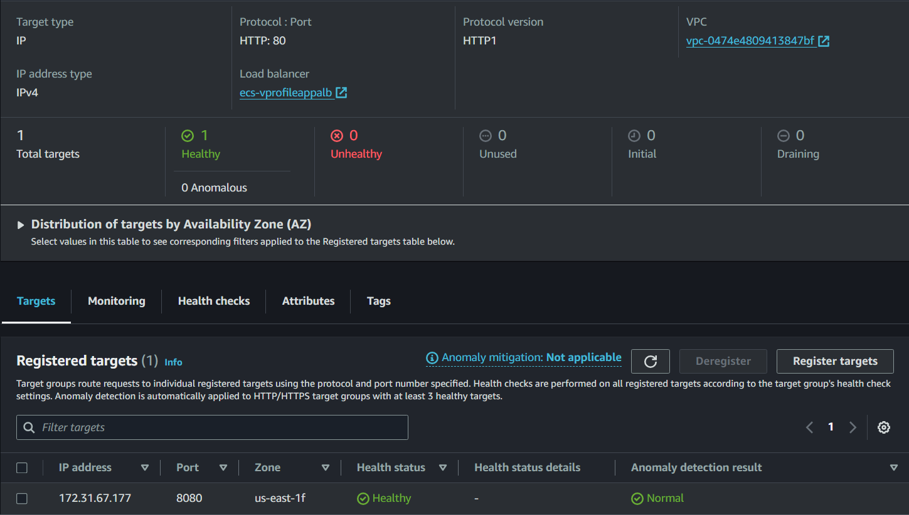

# AWS CI/CD Pipeline with Containers

This project (from the DevOps Udemy Course by Imran Teli) sets up a CI/CD pipeline for a Java application using Jenkins, SonarQube, Docker, and AWS ECS. The process includes fetching code from GitHub, running unit tests and CheckStyle analysis with Maven, performing a quality gate check with SonarQube, building a Docker image, uploading it to Amazon ECR, and deploying it to Amazon ECS.

## Table of Contents

1. [Requirements](#requirements)
2. [Prerequisites](#prerequisites)
3. [Architecture](#architecture)
4. [Steps](#steps)
5. [Usage](#usage)

## Requirements

- Basic knowledge of Java and Maven
- Understanding of Docker and containerization
- Familiarity with Jenkins CI/CD pipelines
- Experience with AWS services (EC2, ECR, ECS, IAM)
- Tools:
    - Git and GitHub
    - Jenkins
    - SonarQube
    - Docker
    - AWS CLI

## Prerequisites

Before setting up the pipeline, ensure the following configurations:

1. **Jenkins and SonarQube Setup on AWS EC2**:
    - **Security Groups**: Ensure security groups allow necessary traffic between Jenkins, SonarQube and Internet.
    - **SSH Key Pairs**: Create key pairs for SSH access to EC2 instances.
    - **Jenkins Plugins**: Install required plugins (SonarQube Scanner, Build Timestamp, Pipeline Maven Integration, Pipeline Utility Steps, Amazon ECR, Docker Pipeline, CloudBees Docker Publish, AWS SDK for Java).
    - **SonarQube Configuration**: Set up Quality Gates, webhooks, and generate a token for Jenkins integration.

2. **AWS Configuration**:
    - **IAM User**: Create an IAM user with ECR and ECS full access policies. Generate CLI access keys.
    - **ECR Repository**: Create an Amazon ECR repository for Docker images.
    - **ECS Cluster**: Create an ECS cluster with Fargate, task definitions, and necessary roles and policies.
    - **AWS CLI**: Install and configure AWS CLI on Jenkins instance.

## Architecture

The architecture of the CI/CD pipeline is as follows:


1. **Code Commit**: Developer commits code to GitHub repository.
2. **Code Fetch**: Jenkins fetches code from GitHub using a webhook.
3. **Unit Tests & Static Code Analysis**: Jenkins runs unit tests and static code analysis using Maven and SonarQube.
4. **Quality Gate**: SonarQube analyzes the code and enforces quality gates.
5. **Docker Image Build**: Jenkins builds a Docker image using the Dockerfile in the repository.
6. **Push to ECR**: Jenkins pushes the Docker image to Amazon ECR.
7. **Deploy to ECS**: Jenkins deploys the Docker image to Amazon ECS.

### Explanation
1. **Developer**: The process begins with the developer making a commit to the GitHub repository.
2. **GitHub Webhook**: This commit triggers a webhook to notify Jenkins of the new commit.
3. **Fetch Code**: Jenkins fetches the code from GitHub.
4. **Maven**: Jenkins runs unit tests and CheckStyle analysis using Maven.
5. **SonarQube**: Jenkins sends the code to SonarQube for static code analysis and quality gate verification.
6. **Docker Build**: If the quality gate is passed, Jenkins builds a Docker image of the application.
7. **Amazon ECR**: The Docker image is then uploaded to Amazon Elastic Container Registry (ECR).
8. **Amazon ECS**: Finally, the image is deployed to Amazon Elastic Container Service (ECS) using a Fargate task.

### ECS Architecture


## Steps

1. **Install AWS CLI on Jenkins Instance**:
    ```sh
    sudo apt update
    sudo apt install awscli -y
    ```

2. **Install Docker Engine on Jenkins (Ubuntu)**:
    ```sh
    sudo apt-get update -y
    sudo apt-get install ca-certificates curl
    sudo install -m 0755 -d /etc/apt/keyrings
    sudo curl -fsSL https://download.docker.com/linux/ubuntu/gpg -o /etc/apt/keyrings/docker.asc
    sudo chmod a+r /etc/apt/keyrings/docker.asc

    echo \
      "deb [arch=$(dpkg --print-architecture) signed-by=/etc/apt/keyrings/docker.asc] https://download.docker.com/linux/ubuntu \
      $(. /etc/os-release && echo "$VERSION_CODENAME") stable" | \
      sudo tee /etc/apt/sources.list.d/docker.list > /dev/null
    sudo apt-get update
    sudo apt-get install docker-ce docker-ce-cli containerd.io docker-buildx-plugin docker-compose-plugin -y
    ```

3. **Add Jenkins User to Docker Group**:
    ```sh
    sudo usermod -aG docker jenkins
   ```
   Reboot the instance to apply changes
   ```sh
    reboot
    ```

4. **Create ECR Repository**:
    - Follow the steps in the AWS Management Console to create an ECR repository.
   

5. **Store AWS Credentials in Jenkins**:
    - Navigate to Jenkins -> Manage Jenkins -> Manage Credentials -> Global -> Add Credentials.
    - Add AWS access key ID and secret access key.

6. **Create ECS Cluster with Fargate: Set up an ECS cluster**:
    - Use the AWS Management Console or AWS CLI to create a new ECS cluster with Fargate launch type.

7. **Create Task Definition**:
    - Define the task with the necessary configurations, including the image URI from ECR and the CloudWatch logs role.

8. **Create a Service**:
    - Create a service in the ECS cluster to manage tasks, using Security groups, an Application Load Balancer (ALB) and Auto Scaling Group (ASG) for scaling and high availability.
      
      
    - Turn off ECS deployment failure detection.

9. **Check Service State and Target Groups**:



10. **Configure Jenkins Pipeline**:
Create a new pipeline job in Jenkins and configure the pipeline script to include the following stages:
- Configure the environment variables
- Fetch Code from GitHub : This is done using the Git plugin in Jenkins, which checks out the repository code.
- Unit Tests & CheckStyle Analysis: Maven runs unit tests and CheckStyle analysis.
- SonarQube Analysis & Quality Gate: The code quality is analyzed by SonarQube and checked against the quality gate.
- Build Docker Image: Jenkins builds the Docker image for the application by using the Dockerfile located in the project repository.
- Upload to Amazon ECR: The Docker image is uploaded to Amazon ECR
- Deploy Docker Image to ECS

## Usage
To run the pipeline, follow these steps:

1. **Trigger the Pipeline**: Push code to the GitHub repository to trigger the Jenkins pipeline.
2. **Monitor the Process**: Check Jenkins for the progress of each stage - fetching code, running tests, quality checks, building, and deploying.
3. **Check Deployment**: Verify the application deployment on Amazon ECS.